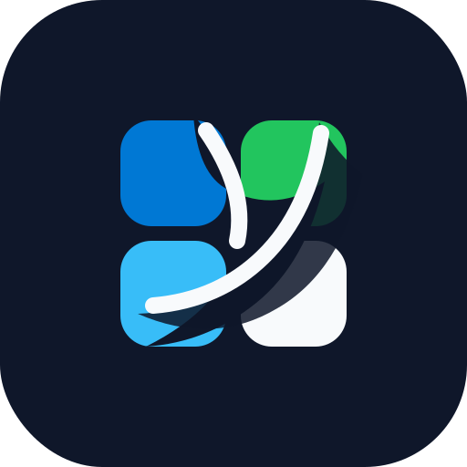

<p align="center">
  
</p>

<h1 align="center">Graphclaw</h1>

<p align="center">
  A Microsoft 365 source collector for your agents.
</p>

<p align="center">
  <a href="https://andrewnova.github.io/graphclaw/">Landing page</a>
  |
  <a href="docs/ARCHITECTURE.md">Architecture</a>
  |
  <a href="docs/PUBLISHING.md">Publishing</a>
</p>

Graphclaw is a Microsoft 365 source collector for your agents. It keeps a
durable local mirror of Outlook mail, calendar events, and contacts, then
exports deterministic JSONL/Markdown your agents can ingest, audit, and enrich.

```bash
graphclaw org add company --tenant organizations --client-id ...
graphclaw auth login --org company
graphclaw sync mail --org company --folder inbox --json
graphclaw export markdown --org company --out ./agent-sources/microsoft --json
```

## What It Does

| Source | Sync primitive | Local projection |
| --- | --- | --- |
| Outlook mail | Microsoft Graph message delta | `mail_messages`, raw JSON, daily markdown |
| Calendar | Microsoft Graph calendarView delta | `calendar_events`, raw JSON, daily agenda pages |
| Contacts | Microsoft Graph contact delta | `contacts`, raw JSON, contacts markdown |

## Why This Exists

Microsoft Graph can list mail and calendar data, but an agent ingestion pipeline
needs more than ad hoc listing:

- resumable delta cursors
- per-company data isolation
- raw provenance
- tombstone/delete tracking
- deterministic Outlook links
- local-first operation
- clean exports for agent workflows

Graphclaw stores each company/org in its own SQLite database:

```text
~/.graphclaw/
  orgs/
    company/
      org.json
      graphclaw.sqlite
    client-a/
      org.json
      graphclaw.sqlite
```

## Install From Source

```bash
cd graphclaw
python3 -m pip install -e .
graphclaw doctor
```

You can also run without installing:

```bash
python3 -m graphclaw doctor
```

## Microsoft App Registration

Create a Microsoft Entra public client app:

1. Azure Portal -> Microsoft Entra ID -> App registrations -> New registration
2. Supported account types: choose what matches your use case
3. Authentication -> allow public client flows
4. API permissions, delegated:
   - `User.Read`
   - `Mail.Read`
   - `Calendars.Read`
   - `Contacts.Read`
   - `offline_access`
5. Copy the Application client ID

Graphclaw uses the OAuth 2.0 device-code flow, which is the right shape for a
terminal collector.

## Quick Start

```bash
graphclaw org add company \
  --tenant organizations \
  --client-id YOUR_ENTRA_APP_CLIENT_ID \
  --account you@company.com

graphclaw auth login --org company
graphclaw auth status --org company
```

Sync the default Inbox:

```bash
graphclaw sync mail --org company --folder inbox --json
```

Discover container IDs when you need them:

```bash
graphclaw list mail-folders --org company --json
graphclaw list calendars --org company --json
graphclaw list contact-folders --org company --json
```

Sync calendar events for a fixed view window:

```bash
graphclaw sync calendar \
  --org company \
  --start 2026-05-01T00:00:00Z \
  --end 2026-06-01T00:00:00Z \
  --json
```

Sync contacts from a contact folder:

```bash
graphclaw sync contacts --org company --folder CONTACT_FOLDER_ID --json
```

Export:

```bash
graphclaw export jsonl --org company --out ./out/company-jsonl --json
graphclaw export markdown --org company --out ./out/company-markdown --json
```

## Multi-Company Model

Every org is isolated by default. Raw stores do not mix. Cross-company search
belongs in your agent memory/search layer after explicit export/import.

Each item carries:

- org id
- account
- source type
- external Graph id
- raw JSON
- deleted/tombstone state
- ingested timestamp

## How Sync Works

Graphclaw stores the full `@odata.deltaLink` per sync scope:

- `mail` scope: account + folder
- `calendar` scope: account + calendar/date window
- `contacts` scope: account + contact folder

On the first run it performs a full delta round. On later runs it resumes from
the saved `@odata.deltaLink`.

## Current Status

This is v0.1:

- direct Graph HTTP, no SDK dependency
- device-code OAuth
- SQLite per org
- mail folder message delta
- calendar view delta
- contacts folder delta
- JSONL and Markdown export

Planned:

- attachment metadata/content policies
- app-only daemon auth for admin-consented tenants
- encrypted token backend
- richer entity extraction bridge
- Microsoft Teams/SharePoint collectors
- optional `m365` CLI adapter for diagnostics

## Security Notes

Graphclaw starts read-only. Do not add write scopes unless you explicitly build
actions that need them.

The v0 token store is in the per-org SQLite DB under `~/.graphclaw`; files are
created with user-only permissions where supported. For production, use an OS
keychain, age/SOPS, or a secrets manager.

## References

- [Microsoft identity platform device-code flow](https://learn.microsoft.com/en-us/entra/identity-platform/scenario-desktop-acquire-token-device-code-flow)
- [Microsoft Graph message delta](https://learn.microsoft.com/en-us/graph/api/message-delta?view=graph-rest-1.0)
- [Microsoft Graph calendarView delta](https://learn.microsoft.com/en-us/graph/delta-query-events)
- [Microsoft Graph contact delta](https://learn.microsoft.com/en-us/graph/api/contact-delta?view=graph-rest-1.0)
